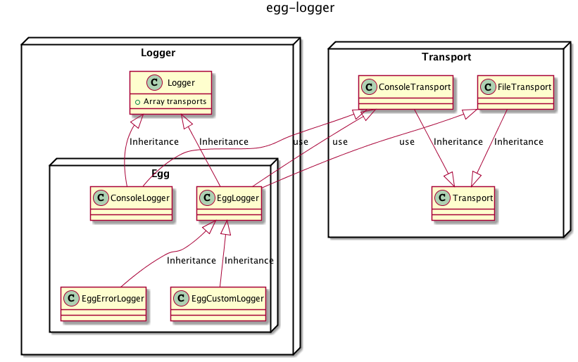

# egg-logger

[![NPM version][npm-image]][npm-url]
[![build status][travis-image]][travis-url]
[![Test coverage][codecov-image]][codecov-url]
[![David deps][david-image]][david-url]
[![Known Vulnerabilities][snyk-image]][snyk-url]
[![npm download][download-image]][download-url]

[npm-image]: https://img.shields.io/npm/v/egg-logger.svg?style=flat-square
[npm-url]: https://npmjs.org/package/egg-logger
[travis-image]: https://img.shields.io/travis/eggjs/egg-logger.svg?style=flat-square
[travis-url]: https://travis-ci.org/eggjs/egg-logger
[codecov-image]: https://codecov.io/github/eggjs/egg-logger/coverage.svg?branch=master
[codecov-url]: https://codecov.io/github/eggjs/egg-logger?branch=master
[david-image]: https://img.shields.io/david/eggjs/egg-logger.svg?style=flat-square
[david-url]: https://david-dm.org/eggjs/egg-logger
[snyk-image]: https://snyk.io/test/npm/egg-logger/badge.svg?style=flat-square
[snyk-url]: https://snyk.io/test/npm/egg-logger
[download-image]: https://img.shields.io/npm/dm/egg-logger.svg?style=flat-square
[download-url]: https://npmjs.org/package/egg-logger

Egg logger.



Including two base class, `Logger` and `Transport`:

- Transport: TBD
- Logger: TBD

---

## Install

```bash
$ npm i egg-logger
```

## Usage

Create a `Logger` and add a file `Transport`.

```js
const Logger = require('egg-logger').Logger;
const FileTransport = require('egg-logger').FileTransport;
const ConsoleTransport = require('egg-logger').ConsoleTransport;

const logger = new Logger();
logger.set('file', new FileTransport({
  file: '/path/to/file',
  level: 'INFO',
}));
logger.set('console', new ConsoleTransport({
  level: 'DEBUG',
}));
logger.debug('debug foo'); // only output to stdout
logger.info('info foo');
logger.warn('warn foo');
logger.error(new Error('error foo'));
```

### Enable / Disable Transport

```js
logger.disable('file');
logger.info('info'); // output nothing
logger.enable('file');
logger.info('info'); // output 'info' string
```

### Redirect

Redirect error log to other logger.

```js
logger.redirect('error', errorLogger);
logger.error(new Error('print to errorLogger')); // equal to `errorLogger.error`
```

### Reload

```js
logger.reload(); // will end the exists write stream and create a new one.
```

### Custom Transport

You can make your own `Transport` for logging，e.g.: send log to your logging server.

```js
const urllib = require('urllib');
const Transport = require('egg-logger').Transport;

class UrllibTransport extends Transport {

  log(level, args, meta) {
    const msg = super.log(level, args, meta);
    return urllib.request('url?msg=' + msg);
  }
}

const logger = new Logger();
logger.set('remote', new UrllibTransport({
  level: 'DEBUG',
}));
logger.info('info');
```

## License

[MIT](LICENSE)
